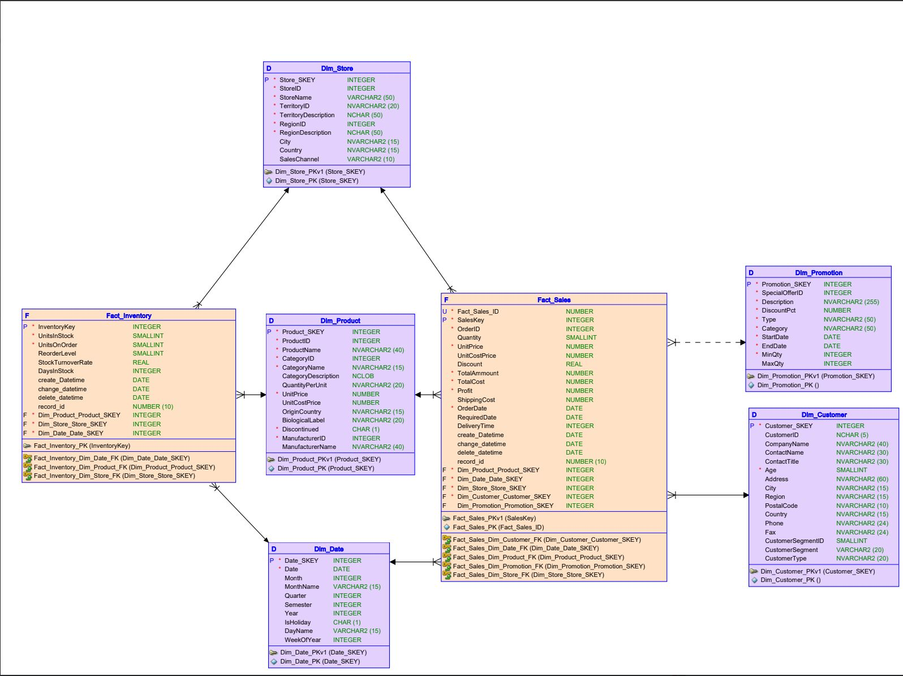

DelishMart - Data Warehouse Dimensional Modeling

This repository contains the first phase of the Business Intelligence project: the **Dimensional Modeling** of the DelishMart Data Warehouse. The goal was to transform operational requirements into a Star Schema optimized for analytical queries.

---

## Project Objective
Design a robust Data Warehouse (DW) structure to support business decision-making, focusing on Sales and Inventory analysis. The project covers the transition from a Logical Model to a Physical Relational Model.

## Tools Used
* **Oracle SQL Developer Data Modeler:** For logical and relational modeling.
* **Oracle SQL:** For DDL (Data Definition Language) script generation.

---

## Data Models

### 1. Logical Model
Focuses on business entities and their relationships without technical constraints.
* **Entities:** Product, Customer, Time, Store, Sales (Fact).

### 2. Relational Model (Star Schema)
The final design uses a **Star Schema** to ensure high performance in BI tools:
* **Fact Tables:** Centralized metrics (Quantity, Total Price, Unit Cost).
* **Dimension Tables:** Descriptive attributes (Product Category, Customer Location, Time Hierarchy).

---

## Deliverables
* **Dimensional Diagram:** Visual representation of the Star Schema.
* **SQL DDL Script:** Ready-to-execute script to create the database schema in an Oracle instance.
* **Documentation:** Technical report detailing mapping and normalization rules.

---

## How to Explore
1.  Check the `sql`  for the database creation script.
2.  Open the `docs` folder for the full technical report and high-resolution diagrams.
3.  The source model can be opened using **Oracle SQL Developer Data Modeler**.

---
